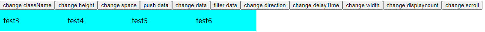

# react-horselight

a react component , display the data like a horse light.

# Example



# Installation

```
npm install react-horselight
#or
yarn add react-horselight
```

# API
| Property | Description | Type | Default |
| --- | --- | --- | --- |
| className | - | string | - |
| data | display data | array | [] |
| space | the space of two element  | number | 10 |
| direction | the elements' move direction  | string | "left" |
| delayTime | interval exection time(ms)  | number | 5000 |
| height | -  | string/number | 30 |
| width | -  | string/number | "100%" |
| displayCount | count of display elements  | number | 4 |
| scroll | -  | Scroll | - |

Scroll:
| Property | Description | Type | Default |
| --- | --- | --- | --- |
| speed | element's move speed(ms) | number | 1000 |
| step | the step of once remove | number | 1 |

# How to use it

```js
import React, { useState } from "react";
import ReactDOM from "react-dom";
import HorseLight from "react-horselight";
import "./index.less";

function getData(data, mode) {
    if (mode === 0) {
        return data;
    } else {
        return (
            <div title={data} style={{ height: "100%", display: "flex", alignItems: "center", justifyContent: "center" }}>
                <span style={{ color: "black" }}>{data}</span>
            </div>
        )
    }
}

function getDatas(length, mode) {
    return new Array(length).fill().map((_, idx) => {
        let data = "test" + idx;
        return getData(data, mode)
    })
}

function App(props) {

    let arrayLength = 10, mode = 1;

    const [className, setClassName] = useState("a");
    const [data, setData] = useState(getDatas(arrayLength, mode))
    const [direction, setDirection] = useState("right");
    const [delayTime, setDelayTime] = useState(1000);
    const [height, setHeight] = useState(50);
    const [width, setWidth] = useState(600);
    const [displayCount, setDisplayCount] = useState(4);
    const [scroll, setScroll] = useState({ speed: 400, step: 1 });
    const [space, setSpace] = useState(5);

    const changeClassName = () => {
        setClassName(cs => {
            if (cs === "a") return "b";
            if (cs === "b") return "a";
        });
    }

    const changeSpace = () => {
        setSpace(sp => sp + 10);
    }

    const changeWidth = () => {
        setWidth(width => width + 5);
    }

    const pushData = () => {
        let oldData = data;
        oldData.push(getData(Math.round(Math.random() * 10 + 1)));
        setData([...oldData]);
    }

    const changeData = () => {
        setData(getDatas(arrayLength, mode));
    }

    const filterData = () => {
        let oldData = data;
        let id = Math.round(Math.round(Math.random() * (arrayLength - 1) + 0));
        oldData = oldData.filter((_, idx) => idx !== id);
        setData(oldData);
    }

    const changeDirection = () => {
        setDirection(dir => {
            if (dir === "left") return "right";
            if (dir === "right") return "left";
        })
    }

    const changeDelayTime = () => {
        setDelayTime(de => de + 1);
    }

    const changeHeight = () => {
        setHeight(he => he + 1);
    }

    const changeDisplayCount = () => {
        setDisplayCount(ds => ds + 1)
    }

    const changeScroll = () => {
        setScroll(sc => ({ ...sc, step: sc.step + 1 }))
    }

    return (
        <div>
            <button onClick={changeClassName}>change className</button>
            <button onClick={changeHeight}>change height</button>
            <button onClick={changeSpace}>change space</button>
            <button onClick={pushData}>push data</button>
            <button onClick={changeData}>change data</button>
            <button onClick={filterData}>filter data</button>
            <button onClick={changeDirection}>change direction</button>
            <button onClick={changeDelayTime}>change delayTime</button>
            <button onClick={changeWidth}>change width</button>
            <button onClick={changeDisplayCount}>change displaycount</button>
            <button onClick={changeScroll}>change scroll</button>
            <HorseLight
                className={className}
                data={data}
                direction={direction}
                delayTime={delayTime}
                height={height}
                width={width}
                displayCount={displayCount}
                scroll={scroll}
                space={space}
            >
            </HorseLight>
        </div >
    );
}

ReactDOM.render(<App />, document.getElementById("app"));
```

# update
1.0.0 
1. 初始化版本